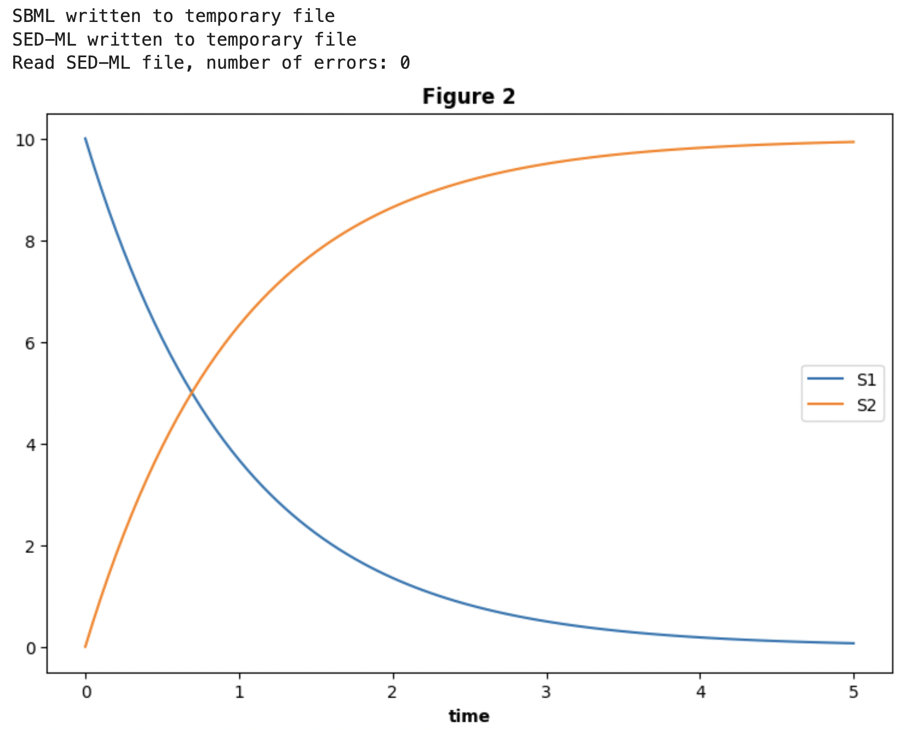

# SimpleSEDML
A simple API for using the [Simulation Experiment Description Markup Language (SED-ML)](https://sed-ml.org/), a community standard for describing simulation experiments.

The project provides a python interface to generating SED-ML based on the abstractions provided by [phraSED-ML](https://pmc.ncbi.nlm.nih.gov/articles/PMC5313123/pdf/nihms846540.pdf) to describe simulation experiments. These absractions are: (a) models (including changes in values of model parameters);
(b) simulations (including deterministic, stochastic, and steady state);
(c) tasks (which specify simulations to run on tasks and repetitions for changes in parameter values);
and (d) output for data reports and plots.

``SimpleSEDML`` generalizes the capabilities of ``PhraSEDML`` and simplifies its usage by exploiting the Python environment:

* A model source can be a file path or URL and may be in the Antimony language as well as SBML;
* Repeated tasks are defined more simply by the use of a ``pandas`` ``DataFrame``.
  
# Example

Consider the model below in the Antimony language.

    mymodel = """
    model myModel
        J1: S1 -> S2; k1*S1;
        k1 = 0.5;
    end
    """

We want to simulate this model and plot the species ``S1``, ``S2``.

    from simple_sedml import SimpleSEDML

    # Compose the experiment description 
    ssed = SimpleSEDML()
    ssed.addModel("model1", mymodel, ref_type="ant_str")
    ssed.AddSimulation("simulation1", "uniform", start=0, end=50, num_step=500)
    ssed.addTask("task1", "model1", "simulation1")
    ssed.addPlot "Conversion of S1 to S2" time vs S1, S2

    # Validate the experiment description
    if ssed.validate():
        print("No errors found.")
    else:
        print(ssed.validate_error)

    # Execute the SEDML on Tellurium
    ssed.execute()

    # Write the sedml to a file
    sedml = ssed.to_sedml()
    with open("my_sedml", "w") as fd:
        fd.write(sedml)

The output is

# Plans
1. Replicate the functions of the text-based ``phraSEDML`` in ``SimpleSEDML``. The implementation should allow for the concurrent construction of multiple ``SimpleSEDML`` objects, something that is not possible the ``phrasedml``.
2. Extend Model by allowing descriptions: (a) automatically convert Antimony into SBML, (b) can reference arbitrary paths to local files, (c) allow URL access.
3. Extend Simulate to report model errors that are detectable without running a simulation.