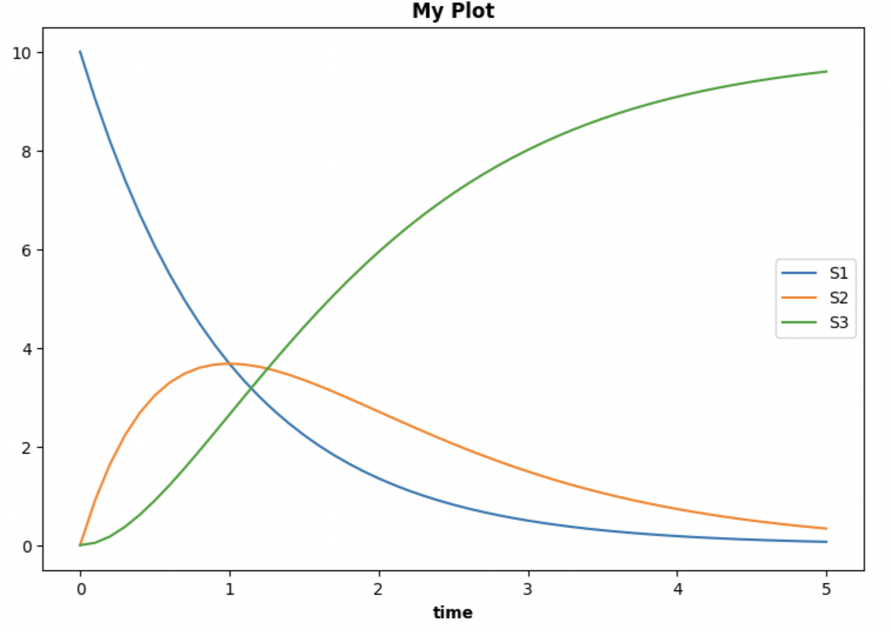

# SimpleSEDML 

SimpleSEDML is a simple API for creating directives in the [Simulation Experiment Description Markup Language (SED-ML)](https://sed-ml.org/) community standard for describing simulation experiments.

``SimpleSEDML`` provides task-oriented APIs that greatly simplify the creation of SED-ML, OMEX files, and validating the results. Some specifics are:

* APIs for running time course simulations (for either a single model or multiple model).
* APIs for doing parameter scans (for either a single model or multiple models).
* Flexibility for model representation in that a model source can be a file path or URL and may be in the Antimony language as well as SBML.

The project provides a python interface to generate SED-ML based on the abstractions provided by [phraSED-ML](https://pmc.ncbi.nlm.nih.gov/articles/PMC5313123/pdf/nihms846540.pdf) to describe simulation experiments. These absractions are: (a) models (including changes in values of model parameters);
(b) simulations (including deterministic, stochastic, and steady state);
(c) tasks (which specify simulations to run on tasks and repetitions for changes in parameter values);
and (d) output for data reports and plots.

## Installation

``SimpleSEDML`` has been tested on python 3.10, 3.11.

    pip install SimpleSEDML

## Public API

All `make*` functions return objects with `getSEDML()`, `getPhraSEDML()`, `execute()`, and `makeOMEXFile()` methods.

| Function | Description |
| --- | --- |
| `makeSingleModelTimeCourse` | Time course simulation for a single model |
| `makeMultipleModelTimeCourse` | Compare multiple models on the same time axis |
| `makeSingleModelParameterScan` | Scan a parameter over a range of values for one model |
| `makeMultipleModelParameterScan` | Scan a parameter across multiple models |
| `makeExecutor` | Run simulations directly via roadrunner, bypassing SED-ML generation |
| `getModelInformation` | Introspect an SBML or Antimony model for its species and parameters |

### Key arguments for `makeSingleModelTimeCourse`

| Argument | Type | Default | Description |
| --- | --- | --- | --- |
| `model_ref` | str | *(required)* | Model source — Antimony/SBML string, file path, or URL |
| `ref_type` | str | auto-detected | Model reference type (see [Model reference types](#model-reference-types)) |
| `start` | float | `0.0` | Simulation start time |
| `end` | float | `5.0` | Simulation end time |
| `num_point` | int | `11` | Number of output time points |
| `num_step` | int | `None` | Number of integration steps (alternative to `num_point`) |
| `display_variables` | list[str] | all floating species | Variables to plot and include in the report |
| `simulation_type` | str | `"uniform"` | Simulation algorithm — `"uniform"` (CVODE), `"uniform_stochastic"` (Gillespie), `"steadystate"`, `"onestep"` |
| `model_parameter_dct` | dict | `None` | Override model parameter values, e.g. `{"k1": 0.5}` |
| `algorithm` | str | `None` | KISAO algorithm ID (overrides `simulation_type` algorithm selection) |
| `title` | str | `""` | Plot title |
| `is_plot` | bool | `True` | Whether to display a plot when `execute()` is called |
| `project_dir` | str | `"project/"` | Directory where model SBML files are written |

### Key arguments for `makeMultipleModelTimeCourse`

| Argument | Type | Default | Description |
| --- | --- | --- | --- |
| `model_refs` | list[str] | `None` | List of model sources — Antimony/SBML strings, file paths, or URLs |
| `start` | float | `0.0` | Simulation start time |
| `end` | float | `5.0` | Simulation end time |
| `num_point` | int | `11` | Number of output time points |
| `num_step` | int | `None` | Number of integration steps (alternative to `num_point`) |
| `display_variables` | list[str] | all floating species | Variables to compare across models |
| `simulation_type` | str | `"uniform"` | Simulation algorithm — `"uniform"`, `"uniform_stochastic"`, `"steadystate"`, `"onestep"` |
| `model_parameter_dct` | dict | `None` | Override parameter values applied to all models, e.g. `{"k1": 0.5}` |
| `algorithm` | str | `None` | KISAO algorithm ID |
| `is_plot` | bool | `True` | Whether to display plots when `execute()` is called |
| `project_dir` | str | `"project/"` | Directory where model SBML files are written |

### Key arguments for `makeSingleModelParameterScan`

| Argument | Type | Default | Description |
| --- | --- | --- | --- |
| `model_ref` | str | *(required)* | Model source — Antimony/SBML string, file path, or URL |
| `scan_parameter_dct` | dict | *(required)* | Parameters to scan; each key is a parameter name and the value is a list of values, e.g. `{"k1": [0.1, 0.5, 1.0]}` |
| `ref_type` | str | auto-detected | Model reference type (see [Model reference types](#model-reference-types)) |
| `simulation_type` | str | `"steadystate"` | Simulation type for each scan point — `"steadystate"` or `"onestep"` |
| `time_interval` | float | `0.5` | Integration interval used when `simulation_type="onestep"` |
| `display_variables` | list[str] | all floating species | Variables to plot on the y-axis |
| `model_parameter_dct` | dict | `None` | Baseline parameter overrides applied before the scan |
| `algorithm` | str | `None` | KISAO algorithm ID |
| `title` | str | `None` | Plot title |
| `is_plot` | bool | `True` | Whether to display a plot when `execute()` is called |
| `project_dir` | str | `"project/"` | Directory where model SBML files are written |

### Key arguments for `makeMultipleModelParameterScan`

| Argument | Type | Default | Description |
| --- | --- | --- | --- |
| `scan_parameter_df` | pd.DataFrame | *(required)* | DataFrame of parameter values to scan; each column is a parameter name and each row is one scan point |
| `model_refs` | list[str] | `None` | List of model sources — Antimony/SBML strings, file paths, or URLs |
| `simulation_type` | str | `"onestep"` | Simulation type for each scan point — `"onestep"` or `"steadystate"` |
| `time_interval` | float | `100` | Integration interval used when `simulation_type="onestep"` |
| `display_variables` | list[str] | all floating species | Variables to compare across models |
| `model_parameter_dct` | dict | `None` | Baseline parameter overrides applied before the scan |
| `algorithm` | str | `None` | KISAO algorithm ID |
| `title` | str | `None` | Plot title |
| `is_plot` | bool | `True` | Whether to display plots when `execute()` is called |
| `project_dir` | str | `"project/"` | Directory where model SBML files are written |

### Key arguments for `makeExecutor`

`makeExecutor` wraps an existing `SimpleSEDML` object and runs simulations directly via roadrunner, bypassing SED-ML/phraSED-ML generation.

| Argument | Type | Default | Description |
| --- | --- | --- | --- |
| `simple` | SimpleSEDML | *(required)* | A constructed `SimpleSEDML` (or subclass) instance |

Once created, the executor exposes three methods:

| Method | Description |
| --- | --- |
| `executeTask(task_id=None, scan_parameter_dct=None)` | Run a single task; returns a `pd.DataFrame`. `scan_parameter_dct` overrides parameter values for this run. |
| `executeRepeatedTask(repeated_task_id=None)` | Run a repeated task (parameter sweep); returns a `pd.DataFrame`. |
| `executePlot2d(plot_id=None, ax=None, kind='line', is_plot=True)` | Execute the simulation(s) required for a 2D plot and render it; returns a `PlotResult(ax, plot_ids)`. |

### Key arguments for `getModelInformation`

| Argument | Type | Default | Description |
| --- | --- | --- | --- |
| `model_ref` | str | *(required)* | Model source — Antimony/SBML string, file path, or URL |
| `ref_type` | str | auto-detected | Model reference type (see [Model reference types](#model-reference-types)) |

Returns a `ModelInformation` object with attributes: `model_name`, `floating_species_dct`, `boundary_species_dct`, `parameter_dct`, `num_reaction`, `num_species`.

### Model reference types

The `ref_type` argument controls how `model_ref` is interpreted. If omitted, SimpleSEDML attempts to auto-detect the type.

| `ref_type` value | Meaning |
| --- | --- |
| `"ant_str"` | Antimony model string (default when a string looks like Antimony) |
| `"sbml_str"` | SBML XML string |
| `"sbml_file"` | Path to a local SBML `.xml` file |
| `"ant_file"` | Path to a local Antimony file |
| `"sbml_url"` | URL pointing to an SBML file |
| `"model_id"` | ID of a previously defined model (for parameter variants) |

## Example

See this [Jupyter notebook](https://github.com/sys-bio/SimpleSEDML/blob/main/examples/usage_examples.ipynb) for a detailed example. It is also available as
a [pdf file](https://github.com/sys-bio/SimpleSEDML/blob/main/examples/vingnette.pdf).

Consider the model below in the Antimony language.

    MODEL_ANT = '''
    model myModel
        J1: S1 -> S2; k1*S1
        J2: S2 -> S3; k2*S2
        
        S1 = 10
        S2 = 0
        k1 = 1
        k2 = 1

        S1 is "species1"
        S2 is "species2"
    end
    '''

We want to simulate this model and do a time course plot of all floating species in the model.

    import SimpleSEDML as ss

    smtc = ss.makeSingleModelTimeCourse(MODEL_ANT, title="My Plot")

The SED-ML generated by this statement can be viewed with

    print(smtc.getSEDML())

This generates the following SED-ML:

    <?xml version="1.0" encoding="UTF-8"?>
    <!-- Created by phraSED-ML version v1.3.0 with libSBML version 5.19.5. -->
    <sedML xmlns="http://sed-ml.org/sed-ml/level1/version4" xmlns:sbml="http://www.sbml.org/sbml/level3/version2/core" level="1" version="4">
    <listOfModels>
        <model id="time_course_model" language="urn:sedml:language:sbml.level-3.version-2" source="/Users/jlheller/home/Technical/repos/SimpleSEDML/examples/time_course_model"/>
    </listOfModels>
    <listOfSimulations>
        <uniformTimeCourse id="time_course_sim" initialTime="0" outputStartTime="0" outputEndTime="5" numberOfSteps="50">
        <algorithm name="CVODE" kisaoID="KISAO:0000019"/>
        </uniformTimeCourse>
    </listOfSimulations>
    <listOfTasks>
        <task id="time_course_task" modelReference="time_course_model" simulationReference="time_course_sim"/>
    </listOfTasks>
    <listOfDataGenerators>
        <dataGenerator id="plot_0_0_0" name="time">
        <math xmlns="http://www.w3.org/1998/Math/MathML">
            <ci> time </ci>
        </math>
        <listOfVariables>
            <variable id="time" symbol="urn:sedml:symbol:time" taskReference="time_course_task" modelReference="time_course_model"/>
        </listOfVariables>
        </dataGenerator>
        <dataGenerator id="plot_0_0_1" name="S1">
        <math xmlns="http://www.w3.org/1998/Math/MathML">
            <ci> S1 </ci>
        </math>
        <listOfVariables>
            <variable id="S1" target="/sbml:sbml/sbml:model/sbml:listOfSpecies/sbml:species[@id='S1']" taskReference="time_course_task" modelReference="time_course_model"/>
        </listOfVariables>
        </dataGenerator>
        <dataGenerator id="plot_0_1_1" name="S2">
        <math xmlns="http://www.w3.org/1998/Math/MathML">
            <ci> S2 </ci>
        </math>
        <listOfVariables>
            <variable id="S2" target="/sbml:sbml/sbml:model/sbml:listOfSpecies/sbml:species[@id='S2']" taskReference="time_course_task" modelReference="time_course_model"/>
        </listOfVariables>
        </dataGenerator>
        <dataGenerator id="plot_0_2_1" name="S3">
        <math xmlns="http://www.w3.org/1998/Math/MathML">
            <ci> S3 </ci>
        </math>
        <listOfVariables>
            <variable id="S3" target="/sbml:sbml/sbml:model/sbml:listOfSpecies/sbml:species[@id='S3']" taskReference="time_course_task" modelReference="time_course_model"/>
        </listOfVariables>
        </dataGenerator>
    </listOfDataGenerators>
    <listOfOutputs>
        <plot2D id="plot_0" name="My Plot">
        <listOfCurves>
            <curve id="plot_0__plot_0_0_0__plot_0_0_1" logX="false" xDataReference="plot_0_0_0" logY="false" yDataReference="plot_0_0_1"/>
            <curve id="plot_0__plot_0_0_0__plot_0_1_1" logX="false" xDataReference="plot_0_0_0" logY="false" yDataReference="plot_0_1_1"/>
            <curve id="plot_0__plot_0_0_0__plot_0_2_1" logX="false" xDataReference="plot_0_0_0" logY="false" yDataReference="plot_0_2_1"/>
        </listOfCurves>
        </plot2D>
    </listOfOutputs>
    </sedML>

The PhraSED-ML to generate the above SED-ML is displayed below (obtained using ``smtc.getPhraSEDML()``). It is considerably more text than the one-line API call.

    time_course_model = model "/Users/jlheller/home/Technical/repos/SimpleSEDML/examples/time_course_model" 
    time_course_sim = simulate uniform(0, 5, 50)
    time_course_sim.algorithm = CVODE
    time_course_task = run time_course_sim on time_course_model
    plot "My Plot" time vs S1, S2, S3

Executing this SED-ML is done by

    smtc.execute()

which generates the following plot:

## Restrictions

1. When multiple tasks or repeated tasks are used alongside a report directive, `execute()` returns only the last simulation's results. Work around this by running simulations individually in Python.
2. Steadystate simulations don't execute correctly (likely a ``PhraSEDML`` issue), but they do generate valid SED-ML.

## Versions

* 0.3.2 4/12/2026
  * Fix bug related to import of pkg_resources is kisao by using setuptools 75.8.2

* 0.3.1 4/12/2026
  * Update README
  * Fix package bugs

* 0.3.0 4/10/2026
  * Fixed problem with OMEX files
  * Updated README.md
  * Fixed bugs related to the URL for WOLF

* 0.2.10 3/6/2026
  * Eliminated blank line at top of metadata.rdf
  * Fixed errors in markdown in README.md
  * Added alt-text to .png in README.md

* 0.2.0 12/5/2025
  * Change in requirements for Windows
  * Updated README for missing .png

* 0.1.2 6/8/2025
  * Updated pip version
  * Fixed bug with legend for MultipleModelTimeCourse

* 0.1.0  6/3/2025
  * MultipleModel constructors have model_refs as optional
  * Many bug fixes

* 0.0.8
  * MultipleModelParameterScan
  * Refactored to create MultipleModelSimpleSEDML, common code for
    MultipleModelParameterScan and MultipleModelTimeCourse

* 0.0.7 5/30/2025
  * Single model parameter scan, but cannot execute for steadystate.
  * Display variables are used on plots.

* 0.0.6  5/27/2025
  * Time courses simulate onestep, stochastic, steadystate
  * Refactored API.

* 0.0.5 5/24/2025
  * Added ".xml" to SBML files
  * Model files are created in a target directory
  * Files created during tests are eliminated
  * Create separate test module for testing SingleModelTimeCourse
  * \_\_init\_\_ exposes ``makeSingleModelTimeCourse``, ``makeMultipleModelTimeCourse``, ``getModelInformation``, ``SimpleSEDML``.
  * Create an OMEX file and validate it
