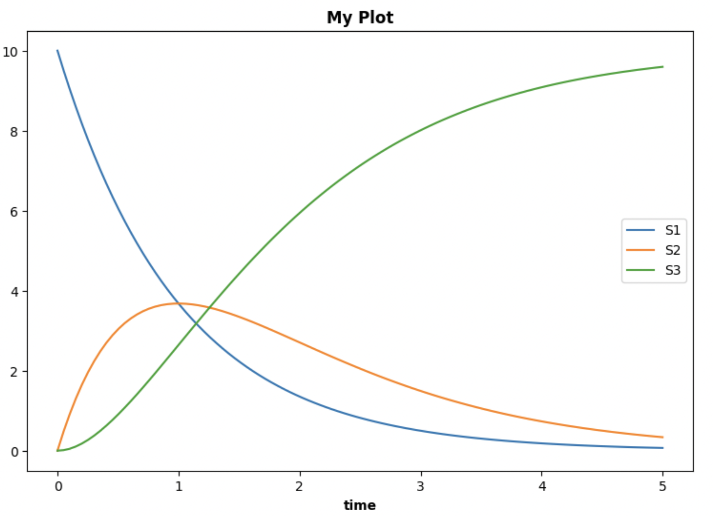

# SimpleSEDML
A simple API for creating directives in the [Simulation Experiment Description Markup Language (SED-ML)](https://sed-ml.org/) community standard for describing simulation experiments.

The project provides a python interface to generate SED-ML based on the abstractions provided by [phraSED-ML](https://pmc.ncbi.nlm.nih.gov/articles/PMC5313123/pdf/nihms846540.pdf) to describe simulation experiments. These absractions are: (a) models (including changes in values of model parameters);
(b) simulations (including deterministic, stochastic, and steady state);
(c) tasks (which specify simulations to run on tasks and repetitions for changes in parameter values);
and (d) output for data reports and plots.

``SimpleSEDML`` generalizes the capabilities of ``PhraSEDML`` and simplifies its usage by exploiting the Python environment:

* A model source can be a file path or URL and may be in the Antimony language as well as SBML;
* Repeated tasks are defined more simply by the use of a ``pandas`` ``DataFrame``.
* Task oriented convenience methods are provided to simplify the API that provides both plots a data (as a ``pandas`` ``DataFrame``).
    * Running a time course for a single model file
    * Running a time course for multiple model files, comparing the results
  
# Example

See this [Jupyter notebook](https://github.com/sys-bio/SimpleSEDML/blob/main/examples/usage_examples.ipynb) for a detailed example. It is also available as
a [pdf file](https://github.com/sys-bio/SimpleSEDML/blob/main/examples/vingnette.pdf).

Consider the model below in the Antimony language.

    MODEL_ANT = '''
    model myModel
        J1: S1 -> S2; k1*S1
        J2: S2 -> S3; k2*S2
        
        S1 = 10
        S2 = 0
        k1 = 1
        k2 = 1

        S1 is "species1"
        S2 is "species2"
    end
    '''

We want to simulate this model and do a time course plot of all floating species in the model.

    import SimpleSEDML as ss

    smtc = ss.makeSingleModelTimeCourse(MODEL_ANT, title="My Plot")

The SED-ML generated by this statement can be viewed with

    print(smtc.getSEDML())

This generates the following SED-ML:

    <?xml version="1.0" encoding="UTF-8"?>
    <!-- Created by phraSED-ML version v1.3.0 with libSBML version 5.19.5. -->
    <sedML xmlns="http://sed-ml.org/sed-ml/level1/version4" xmlns:sbml="http://www.sbml.org/sbml/level3/version2/core" level="1" version="4">
    <listOfModels>
        <model id="time_course_model" language="urn:sedml:language:sbml.level-3.version-2" source="/Users/jlheller/home/Technical/repos/SimpleSEDML/examples/time_course_model"/>
    </listOfModels>
    <listOfSimulations>
        <uniformTimeCourse id="time_course_sim" initialTime="0" outputStartTime="0" outputEndTime="5" numberOfSteps="50">
        <algorithm name="CVODE" kisaoID="KISAO:0000019"/>
        </uniformTimeCourse>
    </listOfSimulations>
    <listOfTasks>
        <task id="time_course_task" modelReference="time_course_model" simulationReference="time_course_sim"/>
    </listOfTasks>
    <listOfDataGenerators>
        <dataGenerator id="plot_0_0_0" name="time">
        <math xmlns="http://www.w3.org/1998/Math/MathML">
            <ci> time </ci>
        </math>
        <listOfVariables>
            <variable id="time" symbol="urn:sedml:symbol:time" taskReference="time_course_task" modelReference="time_course_model"/>
        </listOfVariables>
        </dataGenerator>
        <dataGenerator id="plot_0_0_1" name="S1">
        <math xmlns="http://www.w3.org/1998/Math/MathML">
            <ci> S1 </ci>
        </math>
        <listOfVariables>
            <variable id="S1" target="/sbml:sbml/sbml:model/sbml:listOfSpecies/sbml:species[@id='S1']" taskReference="time_course_task" modelReference="time_course_model"/>
        </listOfVariables>
        </dataGenerator>
        <dataGenerator id="plot_0_1_1" name="S2">
        <math xmlns="http://www.w3.org/1998/Math/MathML">
            <ci> S2 </ci>
        </math>
        <listOfVariables>
            <variable id="S2" target="/sbml:sbml/sbml:model/sbml:listOfSpecies/sbml:species[@id='S2']" taskReference="time_course_task" modelReference="time_course_model"/>
        </listOfVariables>
        </dataGenerator>
        <dataGenerator id="plot_0_2_1" name="S3">
        <math xmlns="http://www.w3.org/1998/Math/MathML">
            <ci> S3 </ci>
        </math>
        <listOfVariables>
            <variable id="S3" target="/sbml:sbml/sbml:model/sbml:listOfSpecies/sbml:species[@id='S3']" taskReference="time_course_task" modelReference="time_course_model"/>
        </listOfVariables>
        </dataGenerator>
    </listOfDataGenerators>
    <listOfOutputs>
        <plot2D id="plot_0" name="My Plot">
        <listOfCurves>
            <curve id="plot_0__plot_0_0_0__plot_0_0_1" logX="false" xDataReference="plot_0_0_0" logY="false" yDataReference="plot_0_0_1"/>
            <curve id="plot_0__plot_0_0_0__plot_0_1_1" logX="false" xDataReference="plot_0_0_0" logY="false" yDataReference="plot_0_1_1"/>
            <curve id="plot_0__plot_0_0_0__plot_0_2_1" logX="false" xDataReference="plot_0_0_0" logY="false" yDataReference="plot_0_2_1"/>
        </listOfCurves>
        </plot2D>
    </listOfOutputs>
    </sedML>

The PhraSED-ML to generate the above SED-ML is displayed below (obtained using ``smtc.getPhraSEDML()``). It is considerably more text than the one-line API call.

    time_course_model = model "/Users/jlheller/home/Technical/repos/SimpleSEDML/examples/time_course_model" 
    time_course_sim = simulate uniform(0, 5, 50)
    time_course_sim.algorithm = CVODE
    time_course_task = run time_course_sim on time_course_model
    plot "My Plot" time vs S1, S2, S3

Executing this SED-ML is done by

    smtc.executeSEDML()

which generates the following plot:

# Restrictions
1. If there are multiple task directives and/or there is a repeated task directive AND there is a report directive, SimpleSEDML.execute only returns the results of the last simulation. You can circumvent this by iterating in python to obtain the desired reports.

# Versions
* 0.1.0  6/3/2025
    * MultipleModel constructors have model_refs as optional
    * Many bug fixes

* 0.0.8
    * MultipleModelParameterScan
    * Refactored to create MultipleModelSimpleSEDML, common code for
      MultipleModelParameterScan and MultipleModelTimeCourse

* 0.0.7 5/30/2025
    * Single model parameter scan, but cannot execute for steadystate.
    * Display variables are used on plots.

* 0.0.6  5/27/2025
    * Time courses simulate onestep, stochastic, steadystate
    * Refactored API.

* 0.0.5 5/24/2025
    * Added ".xml" to SBML files
    * Model files are created in a target directory
    * Files created during tests are eliminated
    * Create separate test module for testing SingleModelTimeCourse
    * \_\_init\_\_ exposes ``makeSingleModelTimeCourse``, ``makeMultipleModelTimeCourse``, ``getModelInformtation``, ``SimpleSEDML``.
    * Create an OMEX file and validate it
